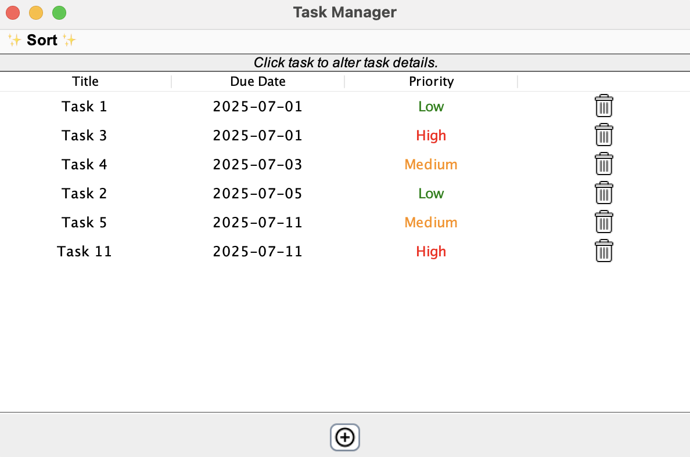

# GUI Based Desktop Task Management Application with AWT/Swing 👩‍💼🧑‍💼
We implement an advanced task management app. Most of the edge cases have been accounted for. By default tasks are sorted by due date(which can be changed manually).
The .jar file, for JXDatePicker, downloaded from Maven Repository has been put in the project's root folder.

## Adding the dependency:

Right click on IntelliJ project --> Open with Module Settings --> Libraries --> "+" icon --> Java --> Select the dependency

The application is at your use!

